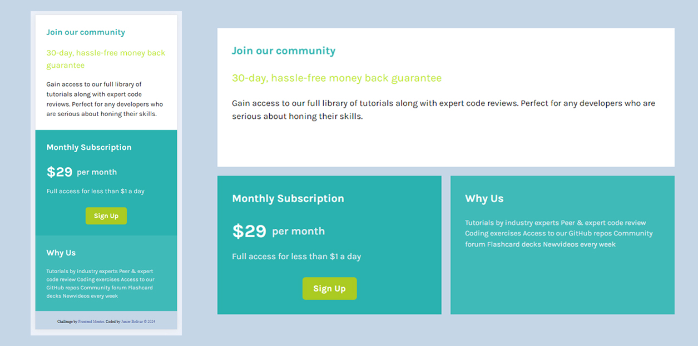

# Frontend Mentor - Single price grid component solution

This is a solution to the [Single price grid component challenge on Frontend Mentor](https://www.frontendmentor.io/challenges/single-price-grid-component-5ce41129d0ff452fec5abbbc). Frontend Mentor challenges help you improve your coding skills by building realistic projects.

## Table of contents

- [Overview](#overview)
  - [Screenshot](#screenshot)
  - [Links](#links)
- [My process](#my-process)
  - [Built with](#built-with)
  - [What I learned](#what-i-learned)
  - [Continued development](#continued-development)
  - [Useful resources](#useful-resources)
- [Author](#author)
- [Acknowledgments](#acknowledgments)

**Note: Delete this note and update the table of contents based on what sections you keep.**

## Overview

### Screenshot



### Links

- Solution URL: (https://github.com/Junbol-Frontend-Mentor/single-price-grid-component)
- Live Site URL: (https://junbol-frontend-mentor.github.io/single-price-grid-component/)

## My process

### Built with

- Semantic HTML5 markup
- CSS custom properties
- Sass(SCSS)
- Flexbox
- Mobile-first workflow
- GIT/GitHub
- PowerShell (CLI)

### What I learned

Working with SCSS Grid Areas

```


@media (min-width: 450px) {
  .container {
    display: grid;
    grid-template-columns: 1fr 1fr; // Two equal columns
    grid-template-rows: 1fr 1fr; // First row auto for the header, second row 1fr for content
    grid-template-areas:
      'legend legend' // Legend spans both columns
      'subscription whyUs'
      'footer footer'; // Subscription and WhyUs each take up half of the second row
    gap: 20px;
    width: 80%;
    padding: 20px;
    margin-top: 100px;
  }

  .legend {
    grid-area: legend; // Assigns the legend card to the 'legend' area
  }

  .subscription {
    grid-area: subscription; // Assigns the subscription card to the 'subscription' area
  }

  .whyUs {
    grid-area: whyUs; // Assigns the WhyUs card to the 'whyUs' area
  }

  .attribution {
    grid-area: footer;
  }
}


```

### Continued development

I would like to continue studying responsive SCSS specially with Grid + Flexbox and CSS animation, transitions and FX like parallax.

### Useful resources

- [web.dev](https://web.dev/learn/css) - This helped me for get back on track with CSS.
- [w3schools](https://www.w3schools.com/css/default.asp) - The one place to refresh stuff in practical way.

## Author

- Website - [Junier Bolivar](https://www.bolivarcreativedesign.com)
- Frontend Mentor - [Junbol](https://www.frontendmentor.io/profile/Junbol)
- Twitter - [@JunierBolivar](https://www.twitter.com/@JunierBolivar)

## Acknowledgments
